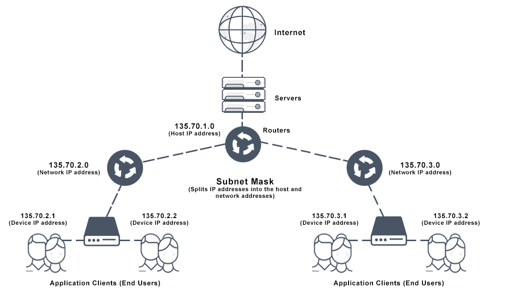
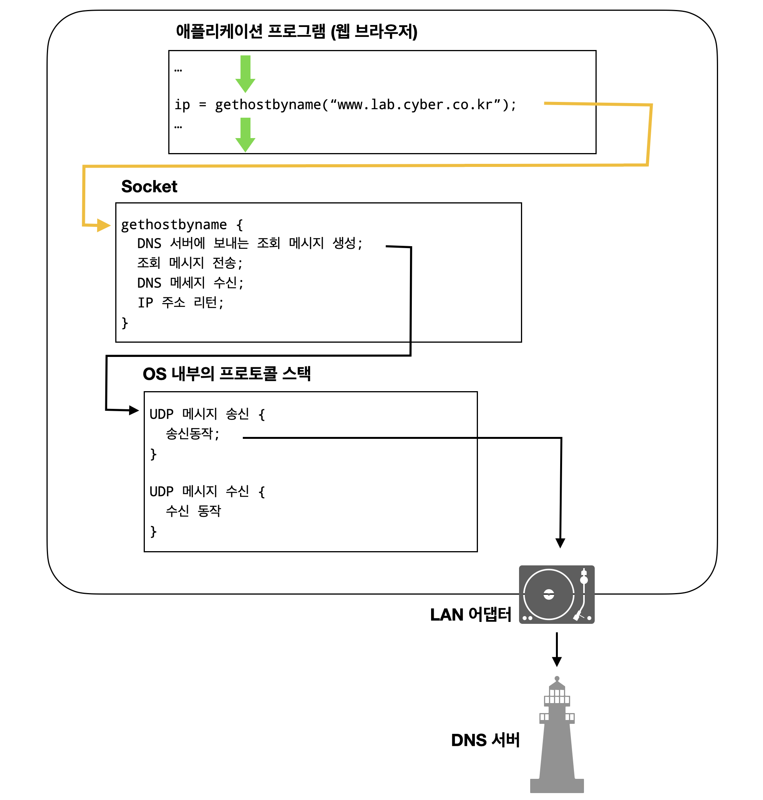
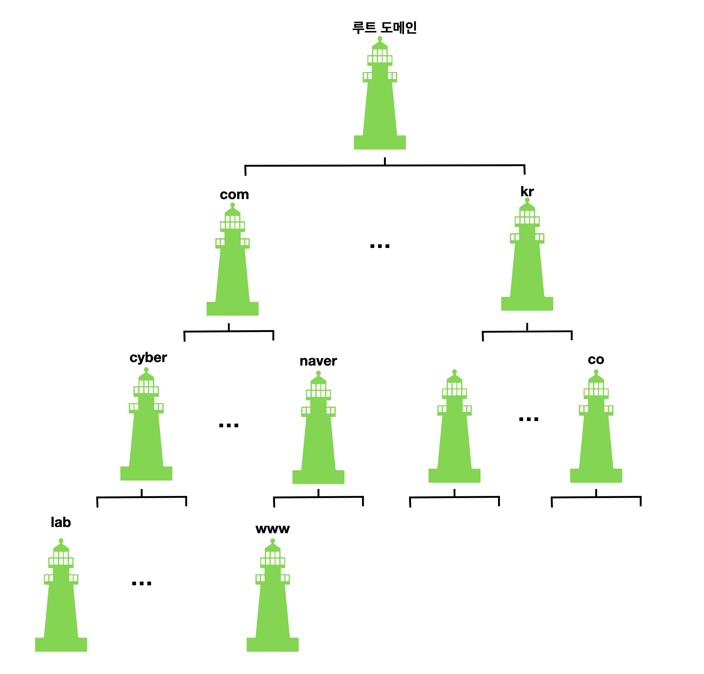
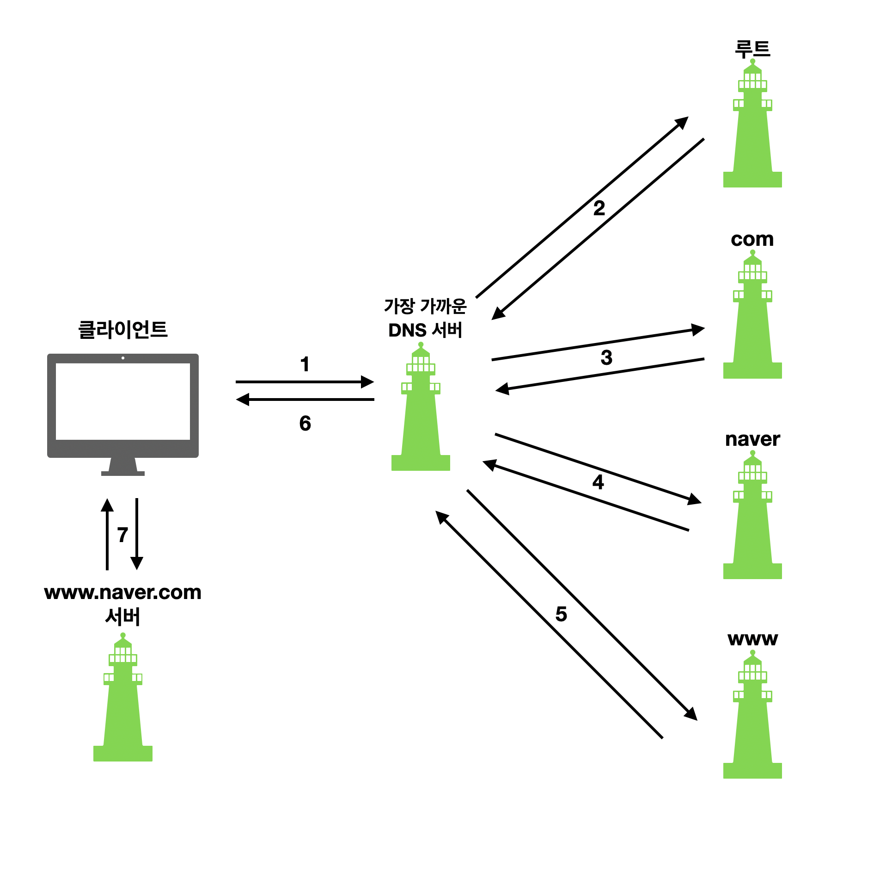

## 웹 브라우저가 메시지를 만든다.

1. [HTTP 리퀘스트 메시지를 작성한다.](#Story 01. HTTP 리퀘스트 메시지를 작성한다.)
2. [웹 서버의 IP 주소를 DNS 서버에 조회한다.](#Story 02. 웹 서버의 IP 주소를 DNS 서버에 조회한다)
3. [전 세계의 DNS 서버가 연대한다.](#Story 03. 전 세계의 DNS 서버가 연대한다)
4. [프로토콜 스택에 메시지 송신을 의뢰한다.](#Story 04. 프로토콜 스택에 메시지 송신을 의뢰한다)


### Story 01. HTTP 리퀘스트 메시지를 작성한다.
#### 1. 탐험 여행은 URL 입력부터 시작한다

**URL(Uniform Resource Locator)**


> 그림 1-1 : 각종 URL의 형식

위에서 보다시피 다양한 URL 형식이 준비되어 있는 것은 이유가 있다. 브라우저는 웹 서버에 액세스하는 클라이언트로 사용하는 경우가 많지만, 브라우저의 기능은 그 외의 기능도 제공합니다. 예를 들어 다운로드/업로드하는 `FTP`의 기능, 메일의 클라이언트 기능도 가지고 있다.

모든 URL 에서는 하나의 공통점이 있다. URL 맨 앞의 `http:` , `ftp:` , `file:`, `mailto:` 에서 액세스하는 방법을 나타내는데 이것들을 `프로토콜` 이라고 부릅니다.


####  2. 브라우저는 먼저 URL을 해독한다.

브라우저는 가장 처음해야하는 일은 입력된 URL을 해독하는 것이다. URL 형식은 프로토콜에 따라 다르므로 여기에서는 `http` 기준으로 설명합니다.


> 출처: minhyung.park

URL은 먼저 위와 같은 요소로 분해합니다.

예를 들어 `http://www.lab.cyber.co.kr/dir1/file1.html`  이라는 URL을 입력시,

-  `http:` : 프로토콜
- `//` 
- `www.lab.cyber.co.kr`  : 웹 서버명
- `/dir1/file1.html` : 해당 웹서버의 파일의 경로

이와 같이 분해할 수 있습니다.

즉, 웹 서버의 파일을 찾아 그 해당 파일에 액세스한다는 의미입니다.


#### 3. 파일명을 생략한 경우

구체적은 파일명을 생략한 URL을 본 경험이 있을 것이다. 크게 보면 4가지 경우가 있는데 이 때에는 어떻게 리소스를 선택하는지 살펴보자.

**case 1. `http://www.lab.cyber.co.kr/dir/`**

URL 규칙에서는 이와 같이 파일명을 생략해도 괜찮지만, 어느 파일에 액세스해야 할지 모릅니다. 

따라서 이럴 경우를 대비해 서버측에서 파일명을 미리 설정해둔다.`index.html` 또는 `default.html` 이라는 파일명을 주로 설정해둔다. 따라서 위와 같이 파일명을 생략하면, 서버에 따라 `/dir/index.html` or `/dir/default.html` 이라는 파일에 액세스한다.


**case 2. `http://www.lab.cyber.co.kr/`**

끝에 `/` 가 있으므로 디렉토리가 지정되고 파일명만 생략된 경우.

따라서 `/index.html` 또는 `/default.html` 이라는 파일에 액세스


**case 3. `http://www.lab.cyber.co.kr`**

끝에 `/` 까지 생략된 경우. 이와 같이 디렉토리명까지 생략해 버리면 무엇을 요청하고 있는지 알지 못하게 되므로 너무 지나친 생략이지만 이런 방법도 인정된다. 경로명이 아무 것도 없는 경우에는 루트 디렉토리 아래에 있는 미리 설정된 파일명의 파일, 즉 `case 2` 와 같게 됩니다.


**case 4. `http://www.lab.cyber.co.kr/whatisthis`**

끝에 `/` 가 없으므로 `whatisthis`를 파일명으로 보는게 맞을 거 같지만, 실제로 사용자 입장에서 파일명을 생략하는 규칙을 정확히 이해하지 못하고 디렉토리 끝의 / 까지 생략하는 경우가 있다. 

따라서, 이런 경우에는 다음과 같이 취급하는 것이 통례다.

- 웹서버에 `whatisthis` 라는 파일이 있으면, 파일명으로
- `whatisthis` 디렉토리가 있으면, 디렉토리명으로

> 동일한 파일명과 디렉토리가 동시에 존재할 수 없으므로, 둘 다 존재하는 경우는 없다.


#### 4. HTTP의 기본 개념

브라우저는 URL을 해독하면 어디에 액세스할지 결정되는데 그 후 *HTTP* 프로토콜을 이용하여 웹 서버에 액세스하게 된다. 따라서, **HTTP(HyperText Transfer Protocol)**에 대해 간단히 알아보자.

**HTTP(HyperText Transfer Protocol)**

>  W3 상에서 정보를 주고받을수 있는 프로토콜이다. 주로 HTML 문서를 주고 받는데에 쓰인다. -  [wikipedia]

클라이언트와 서버가 주고받은 요청/응답의 메시지의 내용이나 순서를 정한것이다. 

리퀘스트 메시지에는 `무엇을` , `어떻게 해서 ` 라는 내용이 쓰여있다.

'`무엇을`' : *URI* 라는 것으로 나타낸다.

**URI(Uniform Resource Identifier) - 통합 자원 식별자**

인터넷에 있는 자원을 나타내는 유일한 주소이다. 

 


`어떻게 해서` : [HTTP 메소드](https://developer.mozilla.org/ko/docs/Web/HTTP/Methods)

웹 서버에 어떤 동작을 하고 싶은지를 전달

| 메소드  | HTTP 1.0 | HTTP 1.1 | 의미                                                         |
| ------- | -------- | -------- | ------------------------------------------------------------ |
| GET     | O        | O        | URI로 지정한 정보를 도출                                     |
| POST    | O        | O        | 클라이언트에서 서버로 데이터를 송신                          |
| HEAD    | O        | O        | GET과 비슷. 단, HTTP 메시지 헤더만 반송하고 데이터의 내용을 돌려보내지 않습니다. |
| OPTIONS |          | O        | 통신 옵션을 통지하거나 조사할 때 사용합니다                  |
| PUT     | △        | O        | URI로 지정한 서버의 파일을 치환합니다.  - 목적 리소스 모든 현재 표시를 요청 payload로 바꿉니다. |
| DELETE  | △        | O        | 목적 리소스를 삭제합니다.                                    |
| TRACE   |          | O        | 목적 리소스의 경로를 따라 메시지 loop-back 테스트를 합니다.  |
| CONNECT |          | O        | 암호화한 메시지를 프록시로 전송할 때 이용하는 메소드입니다.  |


리퀘스트 메시지가 웹 서버에 도착하면 웹 서버는 그 속에 쓰여있는 내용을 해독합니다. 결과 데이터를 응답 메시지에 저장합니다. 응답 메시지의 맨 앞부분에는 실행결과를 나타내는 Status code (ex. 200 OK, 404 Not Found)가 포함되어 있습니다. 이러한 응답 메시지가 클라이언트측에 도착하면 브라우저가 메시지를 해석하여 화면에 표시해주면서 HTTP 동작은 끝납니다.

리퀘스트 메시지와 응답 메시지의 자세한 내용은 뒤에서 알아보겠다.

#### 5. HTTP 리퀘스트 메시지를 만든다.

브라우저는 URL을 해독하고 웹서버와 파일명을 판단하면 이것을 바탕으로 HTTP 메시지를 작성합니다.

```bash
# 리퀘스트 메시지 포맷
<메소드><공백><URI><공백><HTTP 버전> # 이 첫번째 행을 '리퀘스트 라인'
<필드명>:<필드값>                  # '메시지 헤더 부분'
...
...
...
<공백 행>
<메시지 본문>                    # 메시지 본문 : 클라이언트에서 서버에 송신하는 데이터

# 응답 메시지 포맷
<HTTP 버전><공백><스테이터스 코드><공백><응답 문구>
<필드명>:<필드값>
...
...
...
<공백 행>
<메시지 본문>  								# 메시지 본문 : 서버에서 클라이언트에 송신하는 데이터
```

HTTP 요청과 응답의 구조는 서로 닮았으며, 그 구조는 다음과 같다.

1. 시작 줄(start-line)에는 실행되어야 할 요청, 또은 요청 수행에 대한 성공 또는 실패가 기록되어 있습니다. 이 줄은 항상 한 줄로 끝납니다.
2. 옵션으로 HTTP 헤더 세트가 들어갑니다. 여기에는 요청에 대한 설명, 혹은 메시지 본문에 대한 설명이 들어갑니다.
3. 요청에 대한 모든 메타 정보가 전송되었음을 알리는 빈 줄(blank line)이 삽입됩니다.
4. 요청과 관련된 내용(HTML 폼 콘텐츠 등)이 옵션으로 들어가거나, 응답과 관련된 문서(document)가 들어갑니다. 본문의 존재 유무 및 크기는 첫 줄과 HTTP 헤더에 명시됩니다.


> 그림 출처 - [developer.mozilla.org](https://developer.mozilla.org/ko/docs/Web/HTTP/Messages)


리퀘스트 메시지는 크게 3가지 요소로 구성되어 있다.

1. **리퀘스트 라인 - 시작줄**
2. **헤더**
3. **본문**


**리퀘스트 라인**

리퀘스트 라인은 *3가지 요소*로 이루어져 있다.

1. **메소드** : 브라우저의 동작 상태에 따라 이 메소드가 결정된다.

   *브라우저의 동작 상태 예시*

   - 브라우저의 URL 입력창에 URL을 입력
   - 웹 페이지 안의 하이퍼링크 클릭
   - 폼에 데이터를 기입하여 submit
   - ...

2.  **URI**

   URI 부분에는 파일이나 프로그램의 경로명을 쓰는 것이 보통입니다.

3. **HTTP 버전**


[**헤더(Header)**](https://developer.mozilla.org/ko/docs/Web/HTTP/Headers)

헤더는 부가적인 자세한 정보를 제공하는 역할을 한다. 다양한 종류의 요청 헤더가 있는데, 이들은 몇몇 그룹으로 나누어진다.

- General 헤더 : 리퀘스트 메시지와 리스폰스 메시지 둘 다 사용되는 헤더
  - ex) `Connection`, `Via`, `Cache-Control`
- Request 헤더 : 리퀘스트 메시지에 사용되는 헤더
  - ex) `Accept`, `Authorization` , `User-Agent`
- Entity 헤더 : 요청 본문에 적용되는 헤더. 요청 본문이 없는 경우 entity 헤더는 전송되지 않는다.
  - ex) `Content-Length`


**본문**

메시지 헤더 뒤 공백 행을 넣고 그 뒤에 이어지는 부분. 메시지의 실제 내용이 된다. 일반적으로 `GET`, `HEAD`, `DELETE`, `OPTIONS` 처럼 리소스를 가져오는 요청은 보통 본문이 필요없다.


#### 6. 리퀘스트 메시지를 보내면 응답이 되돌아온다.

응답에 대한 자세한 내용은 6장에서 다루기 때문에, 간단하게 알아보자.

리스폰스 메시지의 포맷도 리퀘스트 메시지와 비슷하다. 
다만 첫번째 행의 경우, 리퀘스트의 실행 결과를 나타내는 [Status code](https://developer.mozilla.org/ko/docs/Web/HTTP/Status) 와 응답 문구를 포함하고 있다.

| code | description                        |
| ---- | ---------------------------------- |
| 1xx  | 처리의 경과 상황 등을 통지         |
| 2xx  | 정상 종료                          |
| 3xx  | 무언가 다른 조치가 필요함을 나타냄 |
| 4xx  | 클라이언트측의 오류                |
| 5xx  | 서버측의 오류                      |

**한 개의 리퀘스트에 대해 한개의 응답만 돌려 보낸다.**

따라서, 한 페이지내에 여러 컨텐츠(이미지 또는 영상)을 포함한 경우 각각 요청을 보내야 한다.


**예시** - html 내의 이미지 태그를 포함한 경우

1. 리퀘스트 메시지

```http
GET /sample.htm HTTP/1.1
Accept: */*
Accept-Language: ja
Accept-Encoding: gzip, deflate
User-Agent: Mozilla/4.0
Host: www.lab.glasscom.com
Connection: Keep-Alive
```

2. '/sample1.htm' 의 리스폰스 메시지

```http
HTTP/1.1 200 OK
Date: Wed, 7 Oct 2020 13:00:00 GMT
Server: Apache
Last-Modified: Wed, 30 Sep 2020 13:00:00 GMT
ETag: "5a9da-27903c726b61"
Accept-Ranges: bytes
Content-Length: 632
Connection: close
Content-Type: text/html

<html>
<head>
<meta http-equiv-"Content-Type" content="text/html"; charset=utf-8">
<title> 인터넷 탐험 여행</title>
</head>

<body>

</body>
</html>
```

3. '/gazou.jpg' 에 해당하는 리퀘스트 메시지

```http
GET /gazou.jpg HTTP/1.1
Accept: */*
Referer: http://www.lab.cyber.co.kr/sample1.htm
Accept-Language: ja
Accept-Encoding: gzip, deflate
User-Agent: Mozilla/4.0
Host: www.lab.cyber.co.kr
Connection: Keep-Alive
```

4. 리스폰스 메시지

```http
HTTP/1.1 200 OK
Date: Wed, 7 Oct 2020 13:00:00 GMT
Server: Apache
Last-Modified: Wed, 30 Sep 2020 13:00:00 GMT
ETag: "5a9da-1913-3aefa236"
Accept-Ranges: bytes
Content-Length: 6419
Connection: close
Content-Type: image/jpeg

이미지 바이너리 데이터
```


### Story 02. 웹 서버의 IP 주소를 DNS 서버에 조회한다

#### 1. IP 주소의 기본

브라우저는 자체적으로 메시지를 네트워크에 송출하는 기능은 없고 OS 에 의뢰하여 웹 서버에 송신하게 된다.
다만 여기서 OS에 송신을 의뢰할 때 `https://www.naver.com` 과 같은 도메인 명으로 의뢰하는 것이 아니라 `127.0.0.1` 과같 **IP 주소**로 상대를 지정해야한다. 따라서, IP 주소를 얻는 과정이 필요하다.

허브를 중심으로 몇 대의 컴퓨터가 모여 서브넷을 이루고, 서브넷들은 라우터를 통해 네트워크를 이루게 된다. 

서브넷에 할당된 주소를 **네트워크 번호**, 각 컴퓨터에 할당된 주소를 **호스트 번호**

**IP**

- 네트워크 번호 : 서브넷에 할당된 주소
- 호스트 번호 : 컴퓨터에 할당된 주소
- IP = 네트워크 번호 + 호스트 번호


이 IP 주소에 따라 액세스 대상이 어디에 있는지 판단하고 메시지가 전달된다.

1. 송신측 -> 허브
2. 허브 -> 라우터
3. 라우터 -> 라우터
4. 라우터 -> 수신측



> 출처 : https://avinetworks.com/glossary/subnet-mask/


#### 2. 도메인명과 IP 주소를 구분하여 사용하는 이유

- 기억하기 쉽게 하기 위해 도메인명을 사용한다.
- IP 주소 대신 도메인명을 사용하지 않는 이유
  - 도메인명은 수십 bytes ~ 255 bytes 를 차지한다 - 라우터에 과부하가 걸린다.
- 따라서 사람은 도메인명, 라우터는 IP 주소를 사용


#### 3. Socket 라이브러리가 IP 주소를 찾는 기능을 제공한다

>  DNS 서버를 어떻게 조회를 하는것인가?


네임 리졸루션(name resolution, 이름 확인)

- DNS 원리를 사용하여 IP 조사하는 것

DNS 리졸버

- DNS 클라이언트
- 네임 리졸루션을 실행하는 주체
- Socket 라이브러리 내의 하나의 프로그램
  - Socket 라이브러리 : 네트워크 기능 호출을 위한 프로그램 라이브러리


#### 4. 리졸버를 이용하여 DNS 서버를 조회한다

리졸버는 애플리케이션에서 Socket 라이브러리를 통해 간단히 호출이 가능하다.

예를 들어

```c
network_application_name (parameter) 
{
  // ...
  
  ip = gethostbyname("www.lab.cyber.co.kr");  // gethostbyname : 리졸버 프로그램명
  
  // ...
}
```

브라우저는 이런 형태로 리졸버를 이용해 IP 주소를 얻고 웹 서버에 메시지를 보낸다.


#### 5. 리졸버 내부의 작동


> 출처: minhyung.park

1. 브라우저가 리졸버를 호출하면 제어가 리졸버의 내부로 넘어간다. 
2. 리졸버는 DNS 에 문의하기 위한 메시지를 만든다. 
3. 리졸버는 직접 메시지를 송신하는 기능을 가지고 있는 것이 아니다. 따라서, OS의 **프로토콜 스택** 을 호출하여 실행을 의뢰합니다. 
4. 프로토컬 스택이 LAN 어댑터를 통해 DNS 서버로 메시지를 송신한다.
5. DNS 서버가 IP 주소를 조회해 응답메시지를 보내준다.


> DNS 서버의 IP 주소는 어떻게 아는 것일까?
>
> - 컴퓨터에 미리 설정되어 있다.


### Story 03. 전 세계의 DNS 서버가 연대한다

#### 1. DNS 서버의 기본 동작

리졸버로부터 DNS 서버가 받는 조회 메시지에는 다음과 같은 내용이 포함되어 있다.

**조회 메시지 구성 요소**

- 이름
  - 서버나 메일 배송 목적지와 같은 이름
- 클래스
  - 인터넷 이외에서의 네트워크 이용까지 검토하여 이것들을 식별하기 위한 정보였다. 하지만, 현재는 인터넷 이외의 네트워크는 소멸되어 `IN`  값만 사용하고 있다.
- 타입
  - 이름에 어떤 타입(종류)의 정보가 지원되는지를 나타냄
  - A : IP 주소 지원 , MX : 메일 배송 목적지 지원 ...


DNS 서버에는 이들 세 가지 정보에 대응하여 클라이언트에 회답하는 항목을 등록해 두었다.

| 이름                | 클래스 | 타입 | 클라이언트 회답하는 항목 |
| ------------------- | ------ | ---- | ------------------------ |
| www.lab.cyber.co.kr | IN     | A    | 192.0.2.226              |
| cyber.co.kr         | IN     | MX   | 10 mail.cyber.co.kr      |
| mail.cyber.co.kr    | IN     | A    | 192.0.2.227              |

이러한 항목들을 하나씩 **리소스 레코드**라고 부른다.

따라서, DNS 서버는 서버에 등록된 도메인명과 IP 주소의 대응표를 조사하여 IP 주소를 회답합니다.


#### 2. DNS 서버의 구조와 동작

위에서는 조회 메시지를 받은 DNS 서버에 해당 정보가 등록되어 있는 경우를 가정하고 설명했다. 하지만, 인터넷에는 막대한 수의 서버가 있으므로 이 전부를 1대의 DNS 서버에 등록하는 것은 불가능하다. 따라서, 조회 메시지를 받은 DNS 서버에 정보가 등록되어 있지 않은 경우를 살펴보자.

인터넷에는 DNS 서버가 수 만대가 있으므로 일일이 모든 DNS 서버들을 찾아갈수 없다. 따라서 DNS 서버는 **계층적 구조** 를 가지고 있다.



> 출처: minhyung.park

예를 들어 `www.naver.com` 이라면, 

- com 도메인
- naver 도메인
- www 도메인

위와 같은 형태로 생각할 수 있습니다.

`kr` 과 `com` 같은 도메인을 **최상위 도메인** 이라고 부릅니다. 사실 이들은 최상위 이지만 최상위 도메인을 연결하는 **루트 도메인** 이 존재합니다. 


이제 그럼 어떠한 방식으로 DNS 서버를 찾아가는 가는지 알아보자.



1. PC 에 등록되어 있는 가까운 DNS 서버에 조회 메시지를 전송
2. 해당 DNS 서버에는 등록되어 있지 않으므로, 루트 도메인부터 조회 시작. 루트에도 등록 되어 있지 않아 하위 도메인인 `com` 도메인의 DNS 서버의 IP 주소를 응답
3. `com` DNS 서버에도 등록되어 있지 않아, 하위 도메인인 `naver` DNS 서버 IP 주소 응답
4. `naver` DNS 서버에도 등록되어 있지 않아, 하위 도메인인 `www` DNS 서버 IP 주소 응답
5. `www` DNS 서버에 최종적으로 `www.naver.com` 에 대한 IP 주소가 등록되어 있어 해당 웹 서버 IP 주소 응답
6. 최초로 조회 메시지를 받은 가장 가까운 DNS 서버는 이 IP 주소를 클라이언트에 응답
7. 웹 서버에 접근


#### 3. DNS 서버는 캐시 기능으로 빠르게 회답할 수 있다

- DNS 서버는 한번 조사한 이름은 캐시에 기록할 수 있다. 
- 캐시에 기록되어있으면 그 정보를 응답해 더 빠르게 동작
- 조회한 이름이 존재하지 않는 다는 것도 캐시 가능

주의할 점

- 캐시에 저장한 후 등록 정보가 변경되는 경우 캐시정보는 잘못된 정보가 된다
- 따라서, 캐시에 저장할 때 유효기간을 설정한다.
- 또, 응답시 캐시 정보인지 등록처 DNS 서버에서 응답한 것인지 알려준다


#### Story 04. 프로토콜 스택에 메시지 송신을 의뢰한다


IP 주소를 조사했으면 IP 주소의 상대, 웹 서버에 메시지를 송신하도록 OS 내부에 있는 **프로토콜 스택** 에 의뢰한다.

이 송수신 동작 전체를 살펴보자. 데이터 송수신은 기본적으로 '데이터 통로'를 통해 수행한다.


> 출처: minhyung.park

위 그림같이 통신을 위해서는 클라이언트와 서버 사이를 일종의 파이프로 연결하는 작업이 필요하다. 이 때, 그 양 끝의 출입구를 **socket (소켓)** 이라고 부릅니다. 따라서 이 소켓을 만들고 연결을 하게됩니다.

데이터 송수신 동작은 아래와 같은 단계로 나누어 볼수 있습니다.

1. 소켓을 만든다(소켓 작성 단계)
2. 서버측의 소켓에 파이프를 연결한다. (접속 단계)
3. 데이터를 송수신한다 (송수신 단계)
4. 파이프를 분리하고 소켓을 말소한다(연결 끊기 단계)


Socket 라이브러리의 프로그램 부품을 이용하여, 이 단계들을 수행하게 되는데 실제로 이 프로그램 부품들은 메시지 내용을 그대로 프로토콜 스택에 전달하는 중개역을 수행하고 실질적인 작업은 하지 않는다.

프로토콜 스택이 어떻게 파이프를 연결하고 데이터를 송수신하는지는 차후에 설명된다 (2장)

#### 1. 소켓 작성단계

이 단계에서는 Socket 라이브러리 안의 *socket* 이라는 프로그램 부품만 호출하면 된다. *socket* 을 호출하면 그 내부에 제어가 넘어가 소켓을 만드는 동작을 실행하고 그 후 애플리케이션으로 제어가 돌아온다. (socket의 내부 동작은 2장에서...)

소켓이 생성되면 디스크립터라는 것이 생성되고 이 디스크립터는 애플리케이션에서 메모리에 기록을 해둔다.

디스크립터

- 소켓을 식별하게 해주는 식별자 역할
- 컴퓨터 내부에서는 복수의 데이터 송수신 동작이 진행될수 있으므로, 소켓들이 여러개 생기고 이 소켓들을 구별할 필요가 있다.
- 예 ) 브라우저에서 2개의 창을 띄워 다른 페이지에 접근하게 될 때

#### 2. 접속 단계

다음으로 만든 소켓을 서버측의 소켓과 접속하도록 프로토콜 스택에 의뢰하게 된다. 이 때 애플리케이션은 Socket 라이브러리의 *connect* 라는 프로그램 부품을 호출하여 이 의뢰동작을 실행한다. connect 프로그램을 실행할 때에는 필요한 것이 3가지가 있다.

1. 디스크립터
   - 소켓 생성시 만들어진 디스크립터
2. 서버 IP 주소
3. 포트 번호

**포트 번호**

IP 주소의 경우는 네트워크에 존재하는 각 컴퓨터를 식별할 수 있는 값이고, 포트 번호는 그 컴퓨터의 소켓을 식별하는 값.

디스크립터와의 차이

- 디스크립터는 소켓을 만들도록 의뢰한 애플리케이션에게 건네주는 값이지, 접속 상대에 건네주는 것이 아니다
- 접속 상대측은 그 값을 모른다.
- 따라서, 서버측 소켓의 디스크립터는 클라이언트에서 알 수 없다.

서버측의 포트번호

- 서버측의 포트 번호는 애플리케이션 종류에 따라 미리 결정된 값을 사용한다는 규칙이 있다.
- ex) 웹 : 80, 443 메일: 25 (자세한 자항은 6장에서...)

웹 서버측에서의 클라이언트 포트번호 식별방법

- 적당한 포트번호 값을 할당하고, 접속 동작을 실행할 때 서버측에 알려준다.


#### 3. 송수신 단계

소켓이 준비가 되면 데이터를 보낼 준비가 완료된 것이다.

애플리케이션은 송신 데이터(HTTP 리퀘스트 메시지)를 메모리에 준비한다.

송신 과정

- 송신을 위해 Socket 라이브러리의 *write* 라는 프로그램 부품을 사용하여 프로토콜 스택에 송신동작 의뢰
- 이 때는 디스크립터와 송신 데이터를 지정한다. (소켓에 이미 상대와 연결되어 있으므로 디스크립터만 사용)
- 송신 데이터는 네트워크를 통해 서버에 도착한다
- 서버는 수신 데이터를 처리하고 응답 메시지를 보낸다

수신 과정

- Socket 라이브러리의 *read* 프로그램 부품을 통해 프로토콜 스택에 수신동작을 의뢰
- 수신 응답 메시지를 **수신 버퍼** 라는 메모리 영역에 저장 - 애플리케이션 내부에 위치


#### 4. 연결 끊기 단계

브라우저가 데이터 수신을 완료하면 송수신 동작이 끝난다. 

Socket 라이브러리의 close 라는 프로그램 부품을 호출하여 프로토콜 스택에 의뢰

연결 끊는 과정

- 웹 서버측는 응답 메시지의 송신을 완료했을 때, 먼저 close 를 호출하여 연결을 끊는다
- 이것이 클라이언트측에 전달되고 클라이언트 소켓은 연결 끊기 단계로 들어간다


> 출처: minhyung.park


### 요약
- 브라우저는 URL을 해독하여 리퀘스트 메시지를 작성한다.
- DNS 서버를 통해 IP 주소를 얻어온다.
- 서버에 리퀘스트 메시지 송신을 프로토콜 스택에 의뢰한다.
