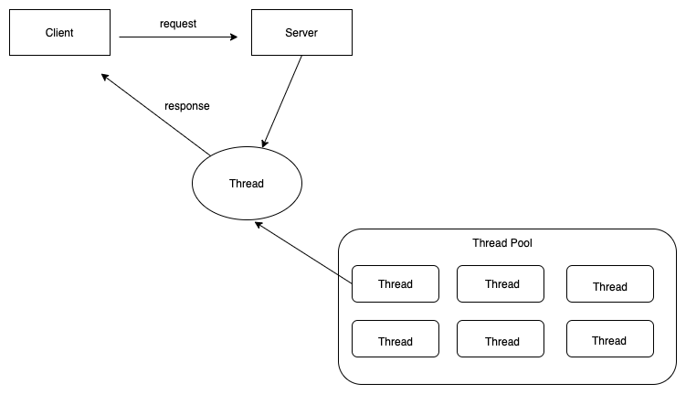
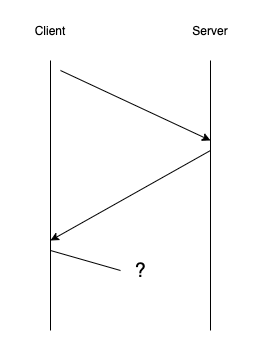
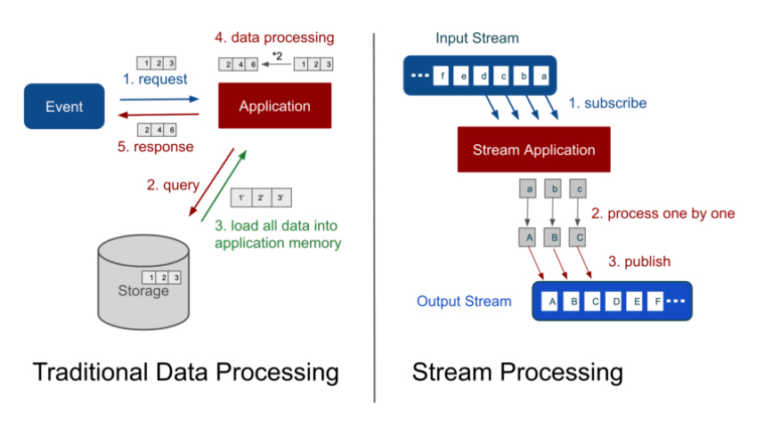
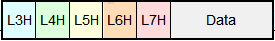
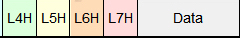
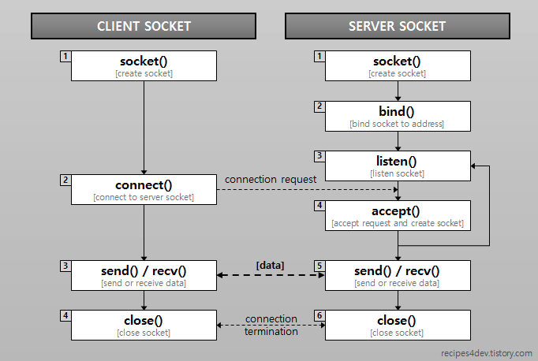
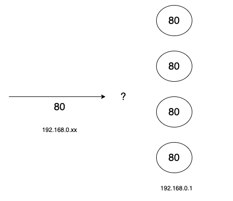
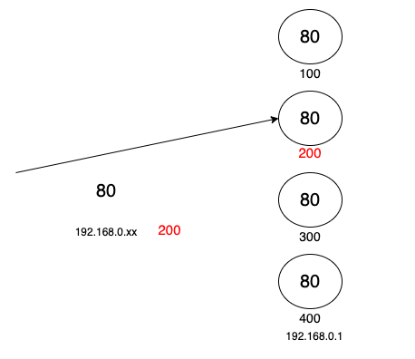
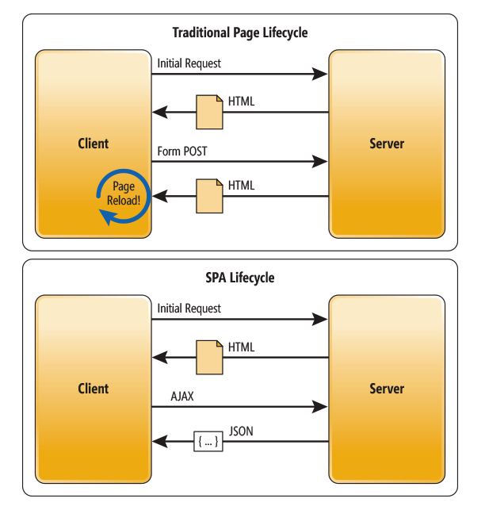

## Chapter 6. 웹 서버에 도착하여 응답 데이터가 웹 브라우저로 돌아간다.  

1. 서버의 개요
2. 서버의 수신 동작
3. 웹 서버 소프트웨어가 리퀘스트 메시지의 의미를 해석하여 요구에 응한다
4. 웹 브라우저가 응답 메시지를 받아 화면에 표시한다

## 1. 서버의 개요

클라이언트로부터 패킷을 수신 -> 처리 -> 응답

#### 1.1 클라이언트와의 공통점과 차이점
- 하드웨어, OS는 다를 수 있다.
- 네트워크(LAN, TCP/IP, Socket)기능은 동일
  - 클라이언트는 접속을 해야하고, 서버는 받아야하기 때문에 Socket 을 사용하는 방법은 다름
- 서버는 동시에 여러 클라이언트에 대응하여야함
  - 각 클라이언트의 대화가 어디까지 진행되고 있는지 파악해야한다.
  

#### 1.2 전통적인 동기식 서비스(요청 당 스레드 or 연결 당 스레드)

    
- 메모리 공간을 확보 후 해당 스레드를 할당(해제) -> 프로그램이 기동(종료)하는 부분에서 시간이 걸리는 문제발생 
- 미리 다수의 스레드를 운영할 수 있게 메모리공간을 확보 후 다수의 스레드를 만들어 놓자 -> 스레드 풀
- 이 스레드 풀에서 하나씩 가져와서 할당  

  
- 클라이언트에서 오는 응답을 기다려야함(blocking)

#### 1.3 Asynchronous & Reactive

>https://velopert.com/267

- event loop 개념

>https://engineering.linecorp.com/ko/blog/reactive-streams-with-armeria-1

- 비동기 방식에도 스트리밍에 문제가 발생할 수 있음
- 이를 해결해줄 수 있는 방법이 Reactive

**More**

- 옵저버 패턴, pub/sub
- netty, vert.x, Armeria, redis, Nginx, node.js

## 2. 서버의 수신 동작

encapsulation & decapsulation 동작 설명, 추상화
electronic signal -> L3 -> L4 

**Layer 3**

- IP 헤더 조사해서 나한테 오는 패킷인지, 스쳐가는 패킷인지 판단
- fragmentation 된 패킷인지 판단
- L4에게 전달

**Layer 4(3-way handshaking)**

- SYN (client)
- Validation Check
- process(copy socket)
- 다시 encapsulation(SYN ACK) -> IP
- ACK (client)
- data 송수신 시작 

**Layer 4(data transportation)**
- Find socket (4 tuple)
- Validation Check
- 수신 버퍼에 저장
- ACK
- 애플리케이션

#### Socket 동작

>https://recipes4dev.tistory.com/153

데이터의 송수신 동작 관점에서 보면 요청하는쪽이 클라이언트고 받는 쪽이 서버
서버가 클라이언트가 될 수 있고 클라이언트도 서버가 될 수 있음.

한번의 통신했을 때만 본다면 반드시 클라이언트 서버는 정해져있다.

소켓, 포트번호, 디스크립터
- bind 를 통해 소켓에 포트번호를 기록한다.
- client 는 포트번호로 접속한다.
- server는 해당 소켓을 복사하여 3-way handshake 수행하고, 원래 소켓은 남아서 접속을 받는다.
- 복사한 소켓은 원래 소켓과 같은 포트번호를 부여받는다.
- 포트번호가 다르면 내가 접속한 곳에서 왔는지, 다른 곳에서 왔는지 판별하기 힘듦
- 이렇게하면 포트번호가 같은 여러 소켓이 존재...

- 그래서 클라이언트의 포트번호도 적어줘야하는거

- 하지만 여러 클라이언트에서 같은 포트로 보낼 수 있으니까 클라이언트의 IP 주소도 포함되어야한다.
- 이 4가지 값이 사용되지않기전에 어떻게 구별?
- 뭐하러 4가지 다 사용해??

## 3. 웹 서버 소프트웨어가 리퀘스트 메시지의 의미를 해석하여 요구에 응한다

### 3.1 전통적인 웹서버

static 한 페이지만 돌려주면 됨
- `GET /index.html HTTP/1.1` 라고 요청을 보내면 서버에서 찾아서 돌려주기만 하면된다.

사용자의 입력을 받아 이를 처리해서 다시 돌려주는 동적인 페이지가 필요해
기존의 웹서버는 정적인 페이지 요청을 URI로 받아서 해당 페이지를 돌려주는 형태이기때문에 이게 불가능

### 3.2 CGI(Common Gateway Interface)
웹서버에서 요청을 받고 다른 프로그램 실행 후 돌려주는 형태인데
표준이 없어서 언어, 시스템의 차이로 불편
이걸 표준화한게 CGI
C, Java, Python 등 다가능..

프로세스 단위로 실행되기때문에 요청이 많아지면 병목이 됨 

### 3.3 Servlet

컨테이너(WAS) 안에서 서블릿(스레드)을 실행하자

하지만 HTML 로 만들어주기 위해서는 print() 메시지로 String -> HTML 태그로 하나하나 만들어줘야했음
+ 매번 빌드가 필요했어

JSP는 HTML 안에 JAVA 코드가 포함되어있음 실행될 때 서블릿으로 변하는건 마찬가지 HTML 표준에 맞춰 작성하기 때문 편함
코드를 변경할 때마다 WAS에서 자동으로 빌드하기때문에 편함

프론트와 백의 구분이 명확하지 않았 REST 아키텍쳐가 도입되어 json을 주고받음, SPA 나오면서
스프링 부트에서 서블릿 기본, JSP 권장 x

>https://linked2ev.github.io/devlog/2018/08/01/WEB-What-is-SPA

### 4. 웹 브라우저가 응답 메시지를 받아 화면에 표시한다

Decapsulation 을 통해 data 복원

- Content-Type 판단 
  - MIME: Multipurpose Internet Mail Extensions
  - 확장자, 데이터 포멧
- Content-Encoding 판단
- 브라우저 
1. 브라우저의 loader 가 해당 response 를 다운로드할지 말지 결정
2. 브라우저의 웹 엔진이 다운로드한 .html 파일을 파싱하여 DOM 트리를 결정
3. .html 파싱중 script 태그를 만나면 파싱을 중단하는 것이 원칙(지연 가능)

4. script 태그에 있는 자원을 다운로드 하여 처리가 완료되면 다시 파싱을 재개
5. CSS parser 가 역시 .css 파일을 파싱하여 스타일 규칙을 DOM 트리에 추가하여 렌더 트리를 만든다
6. 만들어진 렌더트리를 기반으로 브라우져의 크기에 따라 각 노드들의 크기를 결정
7. 페인트한다 : 렌더링 엔진이 배치를 시작

 

